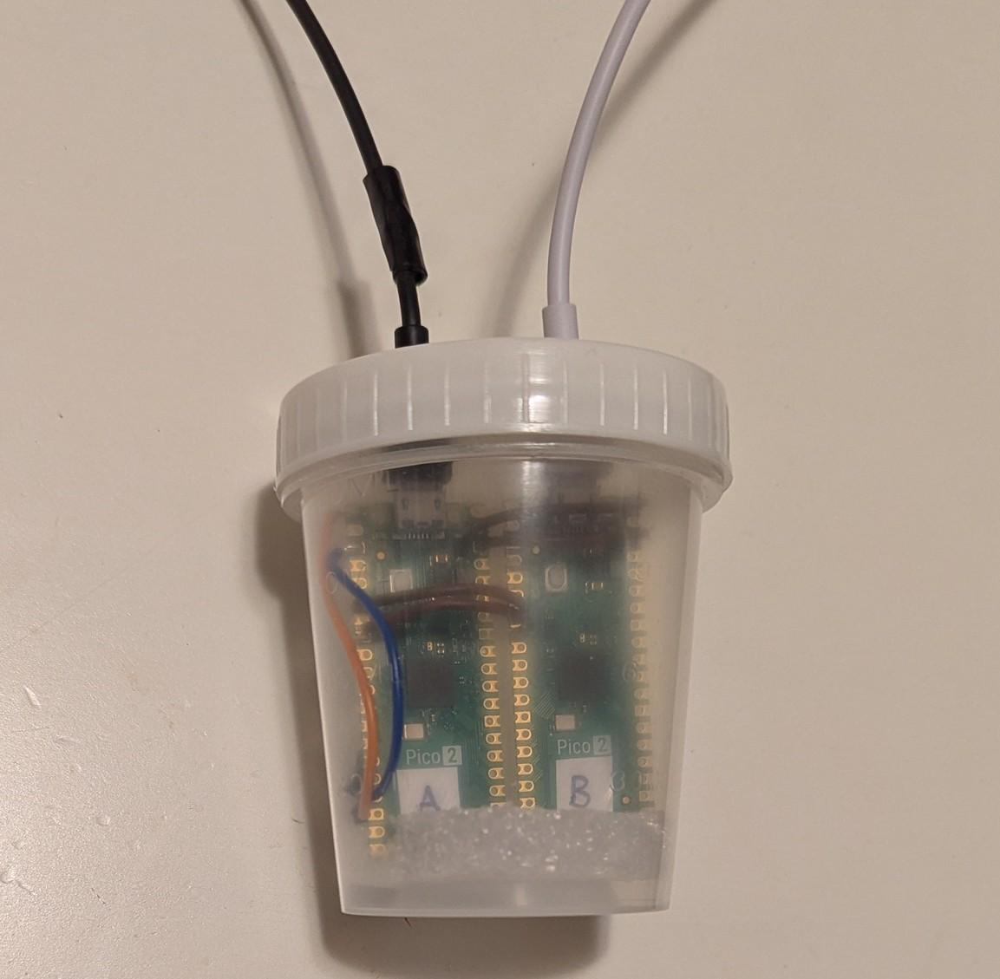
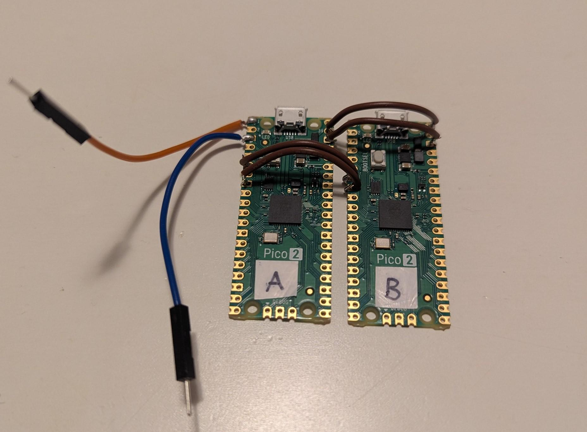

# Lab Input Translator


The purpose of the LIT to perform a translation, allowing a lab instrument to enter reading data into a PC. The instrument is capable of saving data to a USB storage device in the form of a CSV file, but can not enter data directly to a PC. The LIT is a bridge between the lab instrument and the PC. It allows to instrument to save a file to it, then it reads the file and enters the data into the PC.



The LIT consists of two Raspberry Pi Pico microcontrollers. Both of the controllers are configured as USB devices. Controller A is configured as a storage device (MSC) and is connected to it's host, the lab instrument (LI). Controller B is configured as an input device (HID) and is connected to it's host, the PC.  Device A sends data to device B using the UART (Universal Asynchronous Receiver/Transmitter) serial protocol.

```txt
LI --USB--> [A --UART--> B] --USB--> PC
```

In this project device A is named 'msc' (for USB Mass Storage Class) and device B is named 'hid' (for USB Human Interface Device).

## Flashing the microcontrollers

Compiled binaries for stable versions of the code are kept in the `release-bin` folder of this repository. 

To load a program onto the Pico 2, plug the Pico 2 into a PC's USB port while holding down it's button. This puts it into a mode to accept a new binary file. The Pico 2 wil show in the PC's file explorer as an external drive. Copy the uf2 binary file to the Pico 2. After the file is transferred, the Pico 2 will automatically load the program and start running it. This will need to be done for both micrococontrollers in the LIT: hid and msc.

## Assembly pin connections

**power supply**

Both devices are powered by the PC's USB supply voltage. The red power line on device A's USB cable is cut, to disconnect it from the LI's USB supply voltage.
**It is important to cut the power wire in the cable, otherwise the meter's USB power output will be connected to the PC's USB power output, which could potentially damage the meter or the PC.** 

| controller A pin | controller B pin | description |
| --- | --- | --- |
| 39 | 40 | controller B's USB voltage from the PC (VBUS) is connected to controller A's input voltage (VSYS) |
| 38 | 38 | grounds are connected |
| 8 | 8 | grounds are connected |

**UART**

| controller A pin | controller B pin | description |
| --- | --- | --- |
| 6 | 7 | controller A's TX is connected to controller B's RX |
| 1 | NA | serial debug log signal wire from controller A |
| 3 | NA | ground wire from controller A |



## MSC overview

In the tinyUSB example named `cdc_msc`, the microcontroller is configured as a storage device with a filesystem.

There are three changes from the example that were required for the device to work with the lab instrument:

1. In `usb_descriptors.c` and `main.c`, the usb descriptors and configuration were simplified. From the TinyUSB example, the device was a composite device with three interfaces. This was too complex for the lab instrument to connect to. Using a flash drive as a template, the USB configuration was simplified to have one MSC interface.

2. In `msc_disk.c`, `tud_msc_read10_cb` was re-written. Instead of using a real filesystem, it returns sectors that were copied from a flash drive that was known to work with the meter. This bypasses the reverse-engineering challenges of constructing a filesystem to be compatible with the meter. (Note: we found that both FAT16 and FAT32 formatting are compatible.)

3. In `msc_disk.c`, `tud_msc_write10_cb` was re-written. It's purpose was originally to write to memory, now it's purpose is to search for a specific piece of data and send it over UART to the other microcontroller. It identifies a potential CSV file by checking for a comma, then parses the text to search for a number at a specified row and column.

## HID overview

In the tinyUSB example named `hid_multiple_interface`, the microcontroller is configured as a basic keyboard and mouse (When the controller's button is pushed, it types the letter 'a' and moves the mouse).

For the LIT, the function `uart_data_task` in `main.c` was added. It reads characters received from MSC, and sends keycodes to the PC.

## MSC Limitations

`tud_msc_read10_cb` does not handle offsets or reading partial sectors of less than 512 bytes, because during development, requests with these parameters were never observed from a host device.

`tud_msc_write10_cb` uses a parsing approach that will not work for long files. In FAT filesystems, memory is portioned in 512 byte sectors. A file longer than 512 bytes will be stored in two or more sectors, and this means the host OS will call the write function multiple times with partial files. To handle long files, a more complex and robust approach would be needed to piece together the file from multiple write requests and then parse. The CSV file that the lab instrument writes is longer that 512 bytes, but luckily it is just slightly longer (550 bytes) and the relevant data to extract is in the first part.

`tud_msc_write10_cb` does not actually write to a filesystem. It would be possible for a host device to error if it writes, then reads and finds what it had just written isn't there. In testing this hasn't happened.

## Development tooling

This project is developed on a linux PC with the Raspberry Pi Pico VS Code extension. (Git is required as well, to clone the repo.) The VS Code pico extension downloads the pico sdk to `~/.pico-sdk`. For the extension and code syntax highlighting to work, the subfolder of one of the devices (msc or hid) must be open in VS Code. (The VS Code tools will not work properly from the parent folder.)

## Debugging the MSC device

The MSC is configured to send everything that is printed to the UART output at pin 1. I capture the output with a FTDI cable and read the output in my PC's terminal. A serialization tool like Minicom or Picocom is required to read the logs.

```shell
picocom /dev/ttyUSB0 -b 115200
```

Note that the debug logs go out to pin 1 at a 115200 baud rate and the data goes to pin 6 at a 9600 baud rate. The data is slowed down for maximum reliability, but the logs can't be slowed down or else they will lock up the microcontroller processor if TinyUSB debug logs are set to level 3 (verbose). In production, logs should be set to level 1 (error).

## The TinyUSB Library

Both devices are set up based on examples from the TinyUSB C library as a starting point. The examples used are `cdc_msc` and `hid_multiple_interface`. The TinyUSB library is already part of the pico sdk; it does not need to be separately installed.

* https://github.com/hathach/tinyusb
* https://github.com/hathach/tinyusb/tree/master/examples/device/cdc_msc
* https://github.com/hathach/tinyusb/tree/master/examples/device/hid_multiple_interface
* https://docs.tinyusb.org/en/latest/reference/getting_started.html
* https://www.pschatzmann.ch/home/2021/02/19/tinyusb-a-simple-tutorial/

## Linux tools used in development of the MSC

**Reading usb descriptors**

```shell
lsusb
sudo lsusb -d cafe:4003 -v
```

**Hex dump of a drive volume** 

Make sure the volume is not mounted before doing a hexdump.

```shell
lsblk
sudo umount /dev/sdb*
sudo hexdump -C /dev/sdb -s 0 -n 512
```

**XXD code formatted hexdump**

This is like a hexdump, but it formats the output as a C array that you can copy into yor code. It requires installing `vim-common`.

```shell
sudo xxd -s 0 -l 512 -i /dev/sdb1 > boot_sector.h
```
**Wiping a drive**

This command sets all the bits to 0 for the first 40 MB of a drive.

```shell
sudo dd if=/dev/zero of=/dev/sdb bs=1M count=40 status=progress conv=notrunc
```

**Partitioning a drive**

```shell
sudo fdisk /dev/sdb
```

Example prompts:
* o
* n
* p
* 1
* +32M
* t
* 6
* a
* p
* w

**Formatting a drive volume**

```shell
sudo mkfs.vfat -F 16 -s 4 -R 1 -r 512 -v -n "STANDARD" /dev/sdb1
```